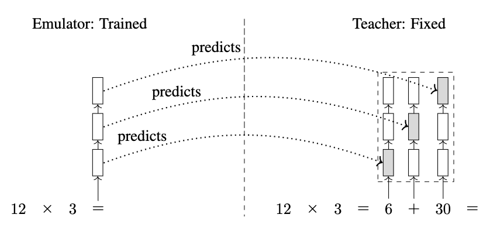

# Implicit Chain of Thought Reasoning via Knowledge Distillation

Here we provide code to reproduce our results.

## Prerequisites

* [PyTorch](https://pytorch.org/get-started/locally/)
* [transformers](https://github.com/huggingface/transformers) (`pip install transformers`)

## Datasets & Pretrained Models & Logs

All dataset files and log files during inference are included in this repo, with the exception of large training files maintained under Git LFS. Model checkpoints are stored on Google Drive. The folder containing all checkpoints can be found at [this link](https://drive.google.com/drive/folders/1Sclr5bmLZIUcktCaFAeWRTevRGLUwlC_?usp=drive_link).

* 4 X 4 Mult - GPT-2: [data](data/4_by_4_mult/) [model](https://drive.google.com/drive/folders/1Zp-PFwiHkwq0wuFScjN5R8jDdXdnQYQ_?usp=sharing) [log](logs/4_by_4_mult/gpt2/log.generate)
* 4 X 4 Mult - GPT-2 Medium: [data](data/4_by_4_mult/) [model](https://drive.google.com/drive/folders/1B0e67ifTSTTuUg0Sh-of5135Rh4KQ-2v?usp=sharing) [log](logs/4_by_4_mult/gpt2-medium/log.generate)
* 5 X 5 Mult - GPT-2: [data](data/5_by_5_mult/) [model](https://drive.google.com/drive/folders/1lHa2Xey8jJ3__RsYRhcOFHU7Xfqp7XTG?usp=sharing) [log](logs/5_by_5_mult/gpt2/log.generate)
* 5 X 5 Mult - GPT-2 Medium: [data](data/5_by_5_mult/) [model](https://drive.google.com/drive/folders/18dRIynq0j5EBOnKTpOPaLJWCoMBXZYTi?usp=sharing) [log](logs/5_by_5_mult/gpt2-medium/log.generate)
* GSM8K - GPT-2: [data](data/5_by_5_mult/) [model](https://drive.google.com/drive/folders/1aFBBcUr_vHtaDqgpU5A1ErEvrJyX-cEO?usp=sharing) [log](logs/gsm8k/gpt2/log.generate)
* GSM8K - GPT-2 Medium: [data](data/5_by_5_mult/) [model](https://drive.google.com/drive/folders/1zFXfwq5jDjgKpbUVafY5KC0LmJpYXjQK?usp=sharing) [log](logs/gsm8k/gpt2-medium/log.generate)

## Usage

We use 4 X 4 Mult with GPT2-Small as an example.


### Training

#### Prerequisite: Teacher Training

```
export FOLDER=data/4_by_4_mult
export MODEL=gpt2
export EPOCHS=1
export LR=5e-5
export BSZ=32
export SAVE=train_models/4_by_4_mult/gpt2/teacher
echo $SAVE
mkdir -p $SAVE
TOKENIZERS_PARALLELISM=false CUDA_VISIBLE_DEVICES=0 stdbuf -oL -eL python src/train_teacher.py \
    --train_path data/${FOLDER}/train.txt \
    --val_path data/${FOLDER}/valid.txt \
    --test_path data/${FOLDER}/test_bigbench.txt \
    --epochs $EPOCHS \
    --lr $LR \
    --model $MODEL \
    --batch_size $BSZ \
    --save_model $SAVE \
    > ${SAVE}/log.train 2>&1&
```

#### (a) Mind-Reading the Teacher


```
export FOLDER=data/4_by_4_mult
export INTERVAL=0
export MODEL=gpt2
export F=diagonal
export EPOCHS=40
export LR=5e-5
export BSZ=32
export QMODEL=train_models/4_by_4_mult/gpt2/teacher/checkpoint_1_5e-05_gpt2
export SAVE=train_models/4_by_4_mult/gpt2/student_initial
mkdir -p $SAVE
TOKENIZERS_PARALLELISM=false CUDA_VISIBLE_DEVICES=0 stdbuf -oL -eL python src/train_mind_reading_student.py \
    --train_path data/${FOLDER}/src1_train.txt \
    --val_path data/${FOLDER}/src1_valid.txt \
    --test_path data/${FOLDER}/src1_test_bigbench.txt \
    --epochs $EPOCHS \
    --lr $LR \
    --model $MODEL \
    --batch_size $BSZ \
    --qmodel $QMODEL \
    --follow $F \
    --save_model $SAVE \
    --interval $INTERVAL \
    --max_new_tokens 20 \
    > ${SAVE}/log.train 2>&1&
```

#### (b) Thought Emulation



```
export FOLDER=data/4_by_4_mult
export INTERVAL=0
export MODEL=gpt2
export LR=5e-5
export M=1
export FEED=p
export USE=argmin
export EPOCHS=40
export BSZ=32
export F=diagonal
export QMODEL=train_models/4_by_4_mult/gpt2/teacher/checkpoint_1_5e-05_gpt2
export SAVE=train_models/4_by_4_mult/gpt2/emulator_initial
mkdir -p $SAVE
CUDA_VISIBLE_DEVICES=3 TOKENIZERS_PARALLELISM=false stdbuf -oL -eL python src/train_thought_emulator.py \
    --train_path data/${FOLDER}/src1_train.txt \
    --val_path data/${FOLDER}/src1_valid.txt \
    --test_path data/${FOLDER}/src1_test_bigbench.txt \
    --epochs $EPOCHS \
    --lr $LR \
    --model $MODEL \
    --batch_size $BSZ \
    --qmodel $QMODEL \
    --follow $F \
    --feed $FEED \
    --use $USE \
    --no_save 0 \
    --save_model $SAVE \
    --interval $INTERVAL \
    --mixture_size $M \
    --use_rnn 1 \
    --use_attn 1 \
    --no_mixture 1 \
    > ${SAVE}/log.train 2>&1&
```

#### (c) Couple and Optimize


```
export FOLDER=data/4_by_4_mult
export INTERVAL=0
export M=1
export E=6
export EPOCHS=40
export LR=5e-5
export F=diagonal
export MODEL=train_models/4_by_4_mult/gpt2/student_initial/checkpoint_3_5e-05
export QMODEL=train_models/4_by_4_mult/gpt2/emulator_initial/checkpoint_${E}_5e-05
export BSZ=32
export A=1
export T=1
export SAVE=train_models/4_by_4_mult/gpt2/
mkdir -p $SAVE
TOKENIZERS_PARALLELISM=false CUDA_VISIBLE_DEVICES=0 stdbuf -oL -eL python src/train_coupled_emulator_and_student.py \
    --train_path ${FOLDER}/train.txt \
    --val_path ${FOLDER}/valid.txt \
    --test_path ${FOLDER}/test_bigbench.txt \
    --epochs $EPOCHS \
    --lr $LR \
    --model $MODEL \
    --batch_size $BSZ \
    --qmodel $QMODEL \
    --save_model $SAVE \
    --accumulate $A \
    --mixture_size $M \
    --additional_norm 0 \
    --no_mixture 1 \
    > ${SAVE}/log.train 2>&1&
```

### Generation & Evaluation

Here we use a pretrained model as an example. Download the folder `models/4_by_4_mult/gpt2`, then the following command will run inference and evaluate both accuracy and throughput, logged in file `generation_logs/4_by_4_mult/log.generate`.

```
export FOLDER=data/4_by_4_mult
export STUDENT=models/4_by_4_mult/gpt2/student
export EMULATOR=models/4_by_4_mult/gpt2/emulator
export BSZ=1
export SAVE=generation_logs/4_by_4_mult
mkdir -p $SAVE
TOKENIZERS_PARALLELISM=false CUDA_VISIBLE_DEVICES=0 stdbuf -oL -eL python src/generate.py \
    --batch_size $BSZ \
    --test_path ${FOLDER}/test_bigbench.txt \
    --student_path $STUDENT \
    --emulator_path $EMULATOR \
    > ${SAVE}/log.generate 2>&1&
```

## Citation

```
@inproceedings{
    anonymous2023implicit,
    title={Implicit Chain of Thought Reasoning via Knowledge Distillation},
    author={Anonymous},
    booktitle={Submitted to The Twelfth International Conference on Learning Representations},
    year={2023},
    url={https://openreview.net/forum?id=9cumTvvlHG},
    note={under review}
}
```
